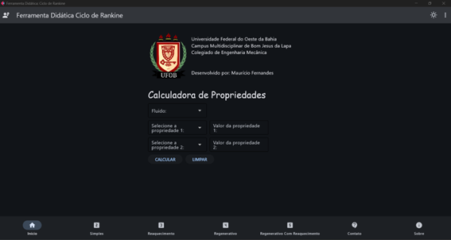
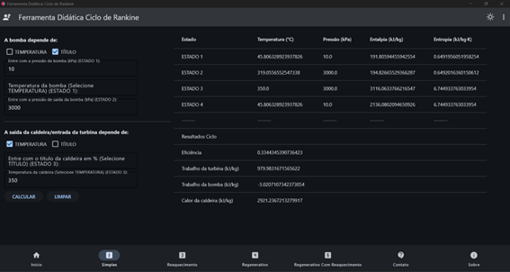
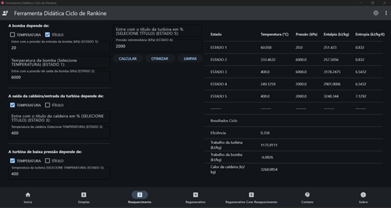
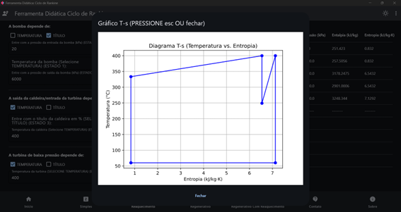
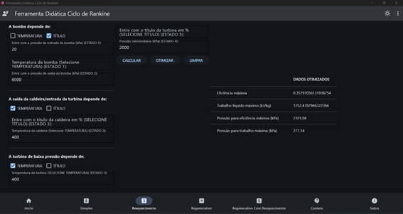
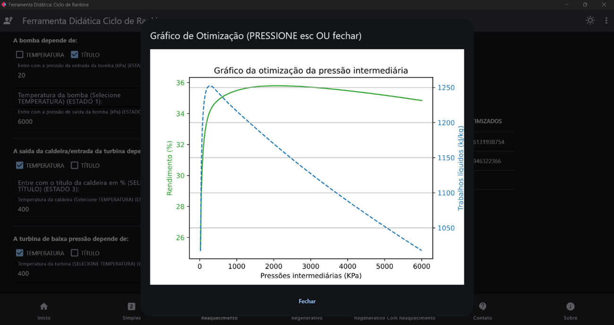

# Ferramenta Didática: Ciclo de Rankine

## 📚 Descrição

Este software é uma ferramenta didática desenvolvida em Python, com uma interface gráfica intuitiva, para estudo e otimização do **ciclo de Rankine** e suas variantes. Criado inicialmente para a comunidade acadêmica da **Universidade Federal do Oeste da Bahia (UFOB)**, ele é especialmente útil em disciplinas como **Termodinâmica Básica**, **Termodinâmica Aplicada**, **Sistemas Térmicos** e **Refrigeração**.

Seu objetivo é permitir que alunos e professores concentrem esforços na **análise e interpretação dos resultados**, deixando que a ferramenta cuide dos cálculos repetitivos.

---

## 🚀 Funcionalidades

✅ **Cálculo de propriedades termodinâmicas**  
✅ **Simulação dos ciclos de Rankine** (Simples, Reaquecimento, Regenerativo e Regenerativo com Reaquecimento)  
✅ **Gráficos automáticos T-s de alguns ciclos**  
✅ **Otimização do ciclo de Reaquecimento**  
✅ **Interface intuitiva com Flet**  
✅ **Aberto para contribuições**

---

## 🛠 Tecnologias utilizadas

| Camada   | Tecnologias                           |
|----------|--------------------------------------|
| Backend  | Python, CoolProp, NumPy, Matplotlib  |
| Frontend | Flet (interface responsiva em Python)|

---

## 🖼️ Exemplos da Interface e Simulações

### 🏠 Tela principal e calculadora de propriedades


---

### 🔥 Ciclo de Rankine Simples


---

### ♨️ Ciclo de Rankine com Reaquecimento


---

### 📈 Gráfico do Ciclo de Rankine com Reaquecimento


---
### ⚙️ Otimização do ciclo de Reaquecimento


---

### 📈 Gráfico do ciclo otimizado


---

## 💻 Como instalar e executar

1. Baixe ou clone este repositório:
   ```bash
   git clone https://github.com/mauriciofernandes123/CICLO-DE-RANKINE.git

2. Extraia o arquivo compactado e abre o diretório no terminal ou IDE:

## No Linux
   
3. Criar o ambiente virtual:
   ```bash
    python.exe -m venv venv
      
4. Comando para ativar o ambiente virtual
   ```bash
   source /venv/bin/activate
      
5. Comando para instalar as bibliotecas:
   ```bash
   pip install -r requirements.txt
        
6. Execute o main.py 
   ```bash
    python.exe main.py
   
## Exemplo no Windows - IDE (Visual Studio Code)
   
3. Comando para criar o ambiente virtual:
   ```bash
    python.exe -m venv venv
      
4. Comando para instalar as bibliotecas:
   ```bash
   pip install -r requirements.txt

5. Execute o main.py 
   ```bash
   python.exe main.py
